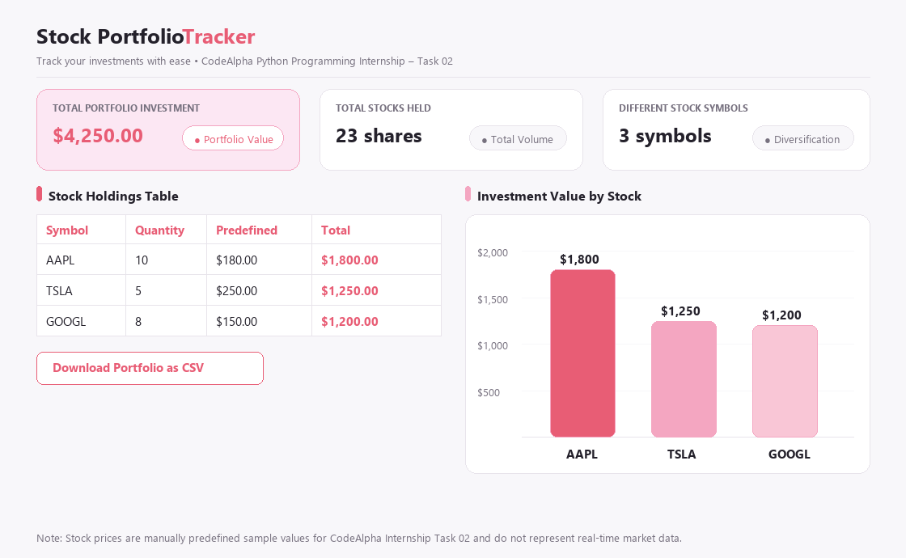
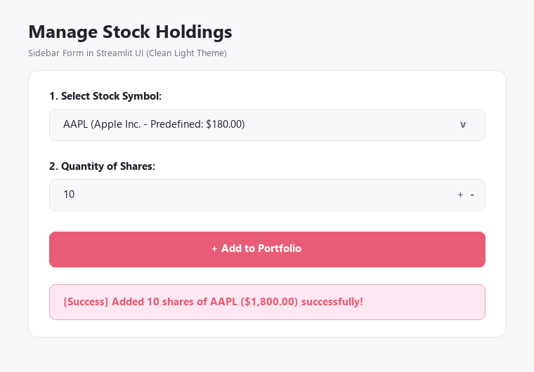
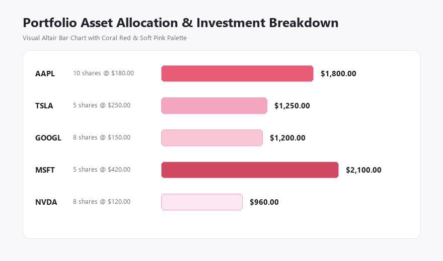
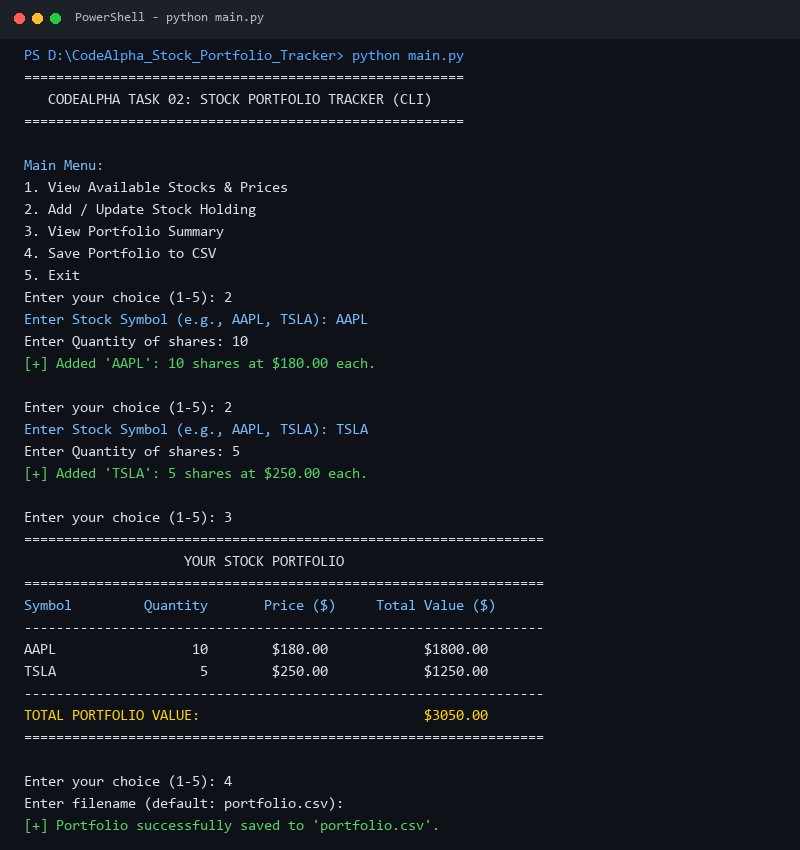

# CodeAlpha Python Programming Internship – Task 02: Stock Portfolio Tracker

A beginner-friendly and feature-complete **Stock Portfolio Tracker** application featuring both a core Python command-line calculation tool and an interactive **Streamlit web dashboard** styled with a clean, modern **Light Theme (Soft Off-White + Coral Red + Soft Pink)** for the **CodeAlpha Python Programming Internship (Task 2)**.

---

## 📖 Project Overview

The **Stock Portfolio Tracker** enables users to monitor their stock investments, compute individual and aggregate asset values using predefined manual stock prices, visualize portfolio allocations, and export their financial summary to CSV format.

> **Note**: Stock prices used in this application are manually predefined sample values (e.g., AAPL = $180, TSLA = $250, GOOGL = $150) for educational and internship demonstration purposes and do not represent live real-time financial market data.

---

## 🎨 UI Design & Color Palette

The Streamlit dashboard features a modern, clean light aesthetic designed for financial clarity:
- **Main Background**: Soft Off-White (`#F8F7FA`)
- **Primary Cards & Sidebar**: Crisp White (`#FFFFFF`)
- **Highlighted Card & Accents**: Light Pink (`#FCE7F3`)
- **Primary Buttons & Key Values**: Coral Red (`#E85D75`)
- **Secondary Accent**: Soft Pink (`#F4A6C1`)
- **Main Typography**: Dark Charcoal (`#24212B`)
- **Secondary Typography**: Balanced Grey (`#77717F`)
- **Borders & Dividers**: Light Grey (`#E8E4EB`)

---

## ✨ Features

- **Predefined Stock Price Registry**: Uses a dictionary storing baseline prices for popular tickers (`AAPL`, `TSLA`, `GOOGL`, `MSFT`, `AMZN`, `NVDA`, `META`).
- **Mathematical Calculation Engine**:
  $$\text{Investment Value} = \text{Quantity} \times \text{Stock Price}$$
  $$\text{Total Portfolio Value} = \sum (\text{Individual Investment Values})$$
- **Input Validation**: Strict validation rejecting negative quantities, non-numeric values, or unsupported stock symbols.
- **Summary Metrics**:
  - **Total Portfolio Investment** (Highlighted soft pink card with coral-red value)
  - **Total Stocks Held** (White card displaying total share volume)
  - **Different Stock Symbols** (White card tracking asset diversification)
- **Visual Investment Breakdown**: Dynamic Altair bar chart with coral-red and soft-pink color tones.
- **CSV Data Export**: Download current holdings directly to a CSV file.
- **Dual Mode**:
  1. **Core Python CLI (`main.py`)**: Terminal-based menu for quick calculation and file export.
  2. **Streamlit Web Dashboard (`app.py`)**: Modern light-themed browser interface.

---

## 🛠️ Technologies Used

- **Language**: Python 3.8+
- **Web Framework**: Streamlit
- **Data Handling**: Pandas & Python Standard Library (`csv`)
- **Visualization**: Altair & Pillow

---

## 🧮 Example Calculation

Suppose a user adds two stock holdings:
1. **Apple Inc. (`AAPL`)**: 10 shares @ \$180.00 each
   $$\text{Value} = 10 \times \$180.00 = \$1,800.00$$
2. **Tesla Inc. (`TSLA`)**: 5 shares @ \$250.00 each
   $$\text{Value} = 5 \times \$250.00 = \$1,250.00$$

**Total Portfolio Investment Value**:
$$\text{Total Value} = \$1,800.00 + \$1,250.00 = \$3,050.00$$

---

## 📋 Requirements & Dependencies

Install all required dependencies using `requirements.txt`:
```text
streamlit>=1.30.0
pandas>=2.0.0
```

---

## 🚀 Installation & Running Instructions

### 1. Open Terminal in Project Directory
```powershell
cd "d:\Nihit Internship\CodeAlpha_Stock_Portfolio_Tracker"
```

### 2. Install Dependencies
```powershell
python -m pip install -r requirements.txt
```

### 3. Run the Core Python Program (CLI)
```powershell
python main.py
```

### 4. Run the Streamlit Web Dashboard
```powershell
streamlit run app.py
```
Your default browser will automatically launch at `http://localhost:8501`.

---

## 📂 Project Structure

```text
CodeAlpha_Stock_Portfolio_Tracker/
│
├── main.py                     # Core Python calculation logic & CLI menu
├── app.py                      # Streamlit Web Dashboard (Clean Light Theme)
├── requirements.txt            # Project dependencies (Streamlit, Pandas)
├── README.md                   # Project documentation & execution guide
├── .gitignore                  # Git ignore rules for cache & environments
└── screenshots/                # Application output screenshots
    ├── dashboard_overview.png  # Clean light dashboard metrics, table, & chart
    ├── add_stock.png           # Sidebar form for adding stock holdings
    ├── portfolio_chart.png     # Asset allocation & breakdown chart
    └── cli_execution.png       # Terminal execution of core main.py
```

---

## 📸 Screenshots

### 1. Streamlit Web Dashboard Overview (Clean Light Theme)


### 2. Add / Update Stock Holdings (Sidebar Form)


### 3. Portfolio Asset Allocation & Chart


### 4. Core Python CLI Execution (`main.py`)


---

## 🎯 Conclusion

The **Stock Portfolio Tracker** delivers a clean, high-contrast light design paired with robust mathematical calculation, structured data handling, and instant visualization tailored for **Task 02 of the CodeAlpha Python Programming Internship**.
